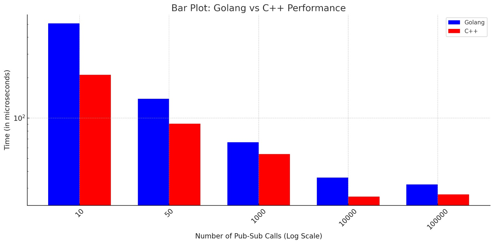
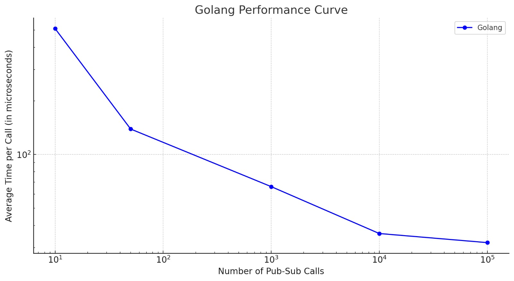

## Problem Statement
**Comparative Analysis of Implementing PubSub in Golang vs. C++**
The end problem we are addressing is an empirical comparison of the performance between Golang and C++ in a Pub/Sub architecture. This involves examining how the intrinsic characteristics of these languages, such as concurrency management, memory handling, and execution efficiency, influence their performance in a distributed, message-oriented setting.
From a Principles of Programming Languages (POPL) perspective, this problem delves into understanding how the design and operational paradigms of different programming languages affect real-world applications, specifically in a Pub/Sub context. This includes examining how language features like Golang's goroutines or C++'s manual memory management and thread handling impact the efficiency, scalability, and overall performance of Pub/Sub systems.
In terms of whether this problem has been solved before, my research indicates that while there are many general comparisons of Golang and C++ in various contexts, a focused study comparing these two languages in a Pub/Sub architecture, especially backed by empirical testing and analysis, appears to be unique or at least not extensively covered in existing literature or studies.
Our approach to this problem is different due to its practical, data-driven nature. By conducting specific tests and analyzing the results, We've provided concrete, quantitative insights into the performance of Golang and C++ in a Pub/Sub scenario. This empirical method offers a more nuanced understanding of how these languages perform under specific conditions, which theoretical analyses or broader comparisons might not capture. This approach is particularly beneficial for system architects and developers who need to make informed decisions based on the specific requirements and constraints of their Pub/Sub systems.

## Software Architecture
The software architecture for the combined C++ and Go implementations revolves around building a Pub-Sub (Publish-Subscribe) mechanism utilizing the Redis database. The primary goal is to provide a modular and efficient solution for managing message subscriptions, publications, and callbacks. Both implementations share common features but exhibit language-specific characteristics in their design.
In the C++ implementation, a `PubSubManager` class encapsulates the Pub-Sub functionality. It employs the cpp_redis library for communication with the Redis server. The class maintains a static unordered map (`subscribers`) to manage callbacks associated with specific channels. The class also utilizes a `cpp_redis::subscriber` object to handle the subscription process, message consumption, and publication. Dynamic memory allocation is used for a cumulative value, and the implementation emphasizes synchronous message handling within a loop.
Contrastingly, the Go implementation utilizes the `github.com/go-redis/redis/v8` library for Redis communication. The `PubSubManager` class in Go embraces Goroutines and channels for asynchronous and concurrent message handling. The subscribers are managed through a standard Go map (`subscribers`). The Redis connection is established using the `redis.NewClient` object, which supports asynchronous subscription and message handling. The Go implementation takes advantage of Goroutines to concurrently handle messages and exhibits a more lightweight and concurrent architecture.
Both implementations interact with Redis as a database, treating it as a cache for storing messages in the Pub-Sub mechanism. The testing components in both languages are locally placed, measuring the time taken for message consumption. The overall design emphasizes principles of encapsulation and abstraction, providing dedicated methods for subscription, publication, and message handling. The Go implementation further emphasizes the Go concurrency model, leveraging Goroutines to enable asynchronous and parallel processing.
In summary, while both implementations achieve the common goal of a Pub-Sub mechanism with Redis, the C++ implementation relies on the cpp_redis library and synchronous processing, while the Go implementation utilizes native language features such as Goroutines for concurrent and asynchronous message handling. The choice of language introduces nuanced differences in the design and execution of the Pub-Sub architecture.

**Code Reuse and Acknowledments**
In our project, we reused the Redis setup in C++ from the Redis documentation. This likely includes the configuration and initialization of the Redis client using the `cpp_redis` library, as well as any relevant connection parameters and settings required for interacting with the Redis server.
On the other hand, the majority of the codebase, including the `PubSubManager` class, message handling, subscription logic, and the testing components, has been developed by us without direct references to external sources. This entails the implementation of the Pub-Sub mechanism, the handling of callbacks, and the overall orchestration of message subscription and publication.

**Is it a client-server architecture?**
**No**,  we have implemented Pub-Sub, which is a mesasgeing pattern used in distributed systems.

**Where is the testing component placed (local or remote)?** 
In both the C++ and Go implementations, the testing component is placed locally. This means that the testing of the Pub-Sub mechanism is conducted on the same machine or environment where the code is developed. The decision to keep testing local could be influenced by factors such as ease of debugging, rapid feedback, and avoiding potential network delays associated with remote testing.

**Is there a database involved?**
 Yes, there is a database involved in both implementations. The database used is Redis. In the Pub-Sub mechanism, Redis serves as a message broker and storage for messages. It allows the Pub-Sub system to operate efficiently by handling the distribution of messages to subscribers and storing messages for later retrieval.

In summary, the testing component is placed locally, and Redis is utilized as the database for managing messages in the Pub-Sub system. Local testing is favored, possibly for ease of development and debugging, while Redis provides a robust solution for handling the messaging aspects of the Pub-Sub architecture.

## PoPL Aspects
1.  **Data Abstraction:**
    
    -   `client := redis.NewClient(&redis.Options{...})`: The Redis client is an abstraction that encapsulates the details of connecting to and interacting with a Redis server. This is an example of data abstraction where the implementation details of the Redis connection are hidden behind the client interface.
 
2.  **Error Handling:**
    
    -   `if err != nil { log.Fatal(err) }`: The code checks for errors during the subscription process. If an error occurs, the program logs the error and terminates. Proper error handling is crucial for robust software, ensuring that unexpected issues are detected and addressed.
        
    -   `if err != nil { log.Printf("Error publishing message: %v", err) }`: Similarly, errors during the message publishing process are logged. This helps in identifying and handling issues that may arise during runtime.
        
3.  **Concurrency (Context Handling):**
    
    -   `ctx := context.Background()`: The use of the context package is related to concurrency and cancellation. It provides a context for managing the Redis subscription and publishing operations. This can be useful for canceling or timing out operations, especially in concurrent or distributed systems.

	- `go publishMessages(ctx, client, "channelName", messageCount)`: The use of the `go` keyword before the `publishMessages` function call indicates that the function should be executed concurrently in a separate goroutine. This is related to the concept of concurrency, allowing the program to perform multiple tasks concurrently. In this case, it enables the continuous publishing of messages while the program waits for user termination.
	- `while (true)`: In a concurrent system (especially in a server environment), it's common to have an event loop to continuously handle events, messages, or requests. This ensures that the program is responsive to incoming events.

4.  **Dynamic Typing and Reflection:**
    
    -   `json.Unmarshal([]byte(msg.Payload), &messageData)`: The `json.Unmarshal` function is used to dynamically decode a JSON-encoded message payload into a map (`messageData`). This is an example of dynamic typing, where the data structure is determined at runtime based on the JSON content.
        
    -   `messageTimestamp := int64(messageData["timestamp"].(float64))`: Type assertion is used here to extract the timestamp from the dynamically decoded map. This is an aspect of reflection, where the program inspects and manipulates its own structure at runtime.
        
5.  **Immutable Data (Time Handling):**
    
    -   `currentTime := time.Now().UnixNano()`: The use of `time.Now()` to get the current time and `UnixNano()` to get the time in nanoseconds adheres to the principle of immutability. The time values are immutable, ensuring that once a time value is created, it cannot be modified.

6.  **Structured Data (JSON Encoding/Decoding):**
    
    -   `messageJSON, _ := json.Marshal(message)`: The `json.Marshal` function is used to encode the message map into a JSON-formatted string (`messageJSON`). This demonstrates the idea of structured data representation, where data is organized in a standardized format (JSON) for communication between systems.

7.  **Resource Management (Deferred Function):**
    
    -   `defer sub.Close()`: The `defer` statement is used to ensure that the subscription (`sub`) is closed when the main function exits. This is an example of resource management, ensuring that resources are properly released when they are no longer needed.

8.  **Imperative and Declarative Code:**
    
    -   `client.Subscribe(...)`, `json.Unmarshal(...)`,etc: The code includes both imperative (describing how to achieve a task) and declarative (stating what the task is without specifying how to achieve it) aspects. For example, the subscription and message processing involve imperative steps, while the JSON encoding/decoding represents a more declarative approach.

9. **Asynchronous Programming:**

-   `go publishMessages(ctx, client, "channelName", messageCount)` and `select {}`: Goroutines provide a way to concurrently execute functions, and the `select {}` statement is a common idiom for creating an infinite loop, allowing asynchronous tasks to continue running.
- `pubsub.consume()`: Asynchronous programming is essential in systems where tasks can be performed concurrently without waiting for each other to complete. This allows the program to continue executing other tasks while waiting for events.

10. **Object-Oriented Programming (OOP) Concepts:**
	- `class PubSubManager`: OOP principles like encapsulation help organize code, improve code readability, and enable the creation of reusable and modular components.

11. **Issues faced while writting code:**
	- `std::thread subscriberThread([&subscriber1]()`: Threading and garbage collection had to be manually done by the developer.

## Results

